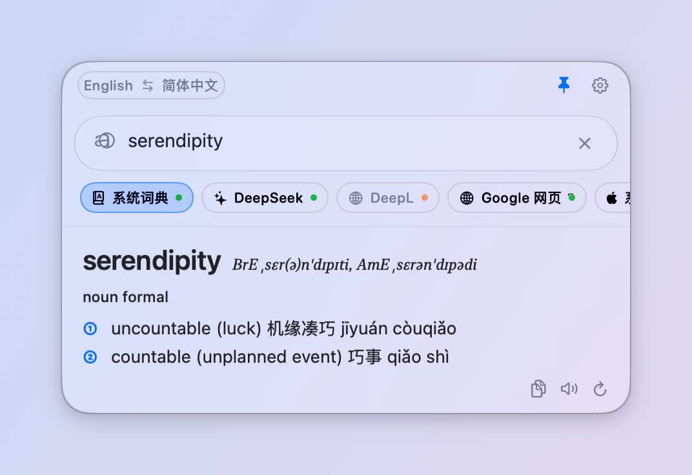
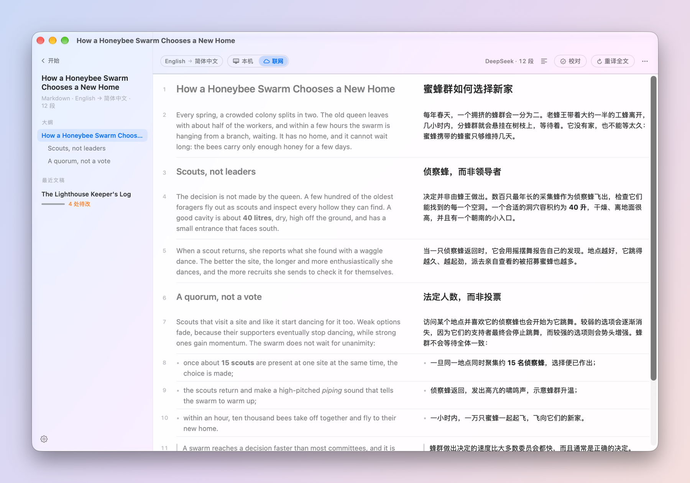
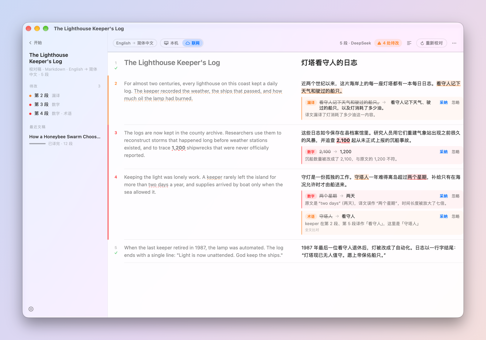
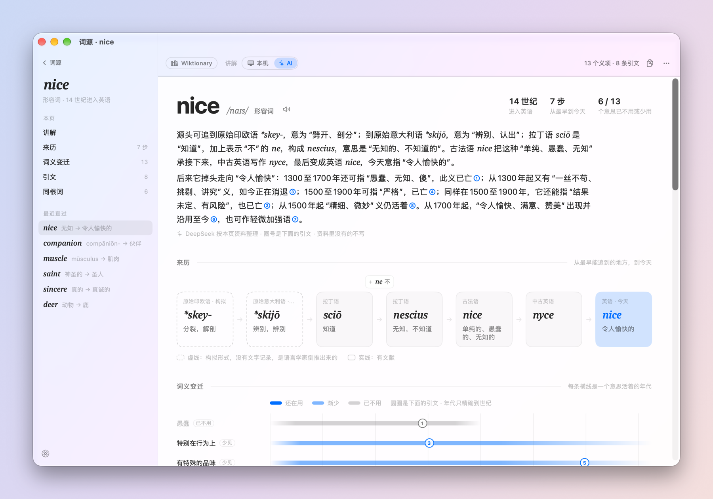
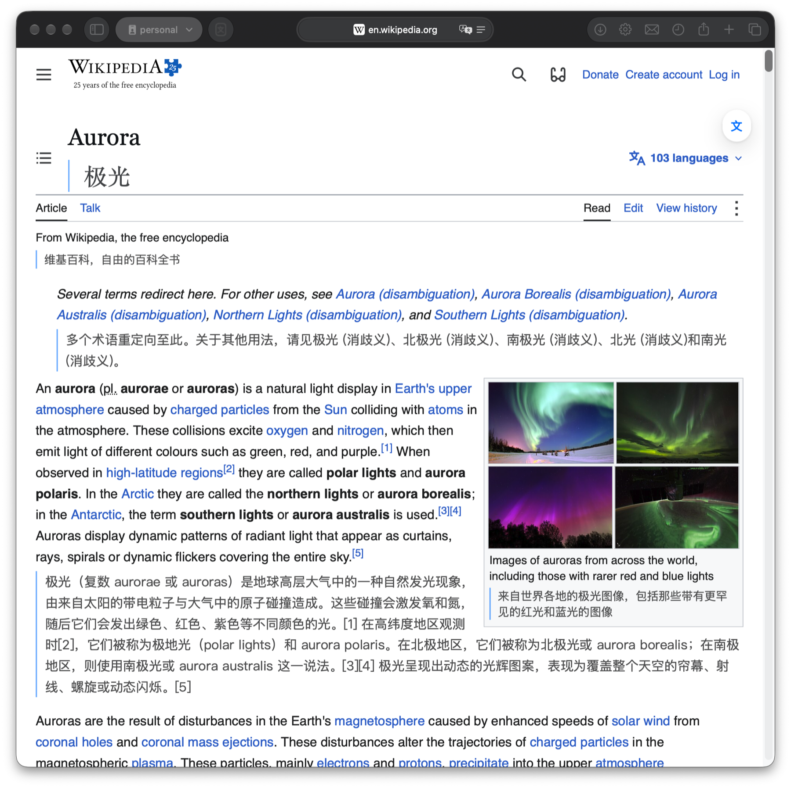

# Lumi

一个原生的 macOS 翻译工具：选中文字就能查词、翻译，长文章可以逐段对照着读，别人的译文可以拿来校对，
Safari 里的网页可以双语对照。受 [Easydict](https://github.com/tisfeng/Easydict) 启发，代码从零写起。



> **现状**：个人项目，作者自己每天在用，但仍在早期。只支持 **macOS 26** 及以上；目前没有编译好的
> 安装包，需要按[下面的步骤](#安装)自己编译。业余维护，issue 不保证及时回复。

想了解实现细节、设计取向和调试方法，请看 [技术说明（TECHSHEET.md）](TECHSHEET.md)。

## 能做什么

### 取词翻译

在任何 App 里选中一段文字，按 **⌥D**，翻译就出现在旁边的小窗口里。

- **几个引擎同时查**：系统词典、系统翻译、Google、DeepL，以及各家大模型（OpenAI、Claude、Gemini、
  DeepSeek、Ollama，或任何 OpenAI 兼容的接口）。结果在同一个窗口里切换，窗口不会越开越长。
- **查单词像查词典**：系统词典的词条会排成词头、读音、编号义项和例句，而不是挤成一大段。
- **没有网也能用**：断网时自动用系统翻译（需要提前在系统设置里下载语言包）。
- **⌥A** 打开输入框手动输入，**⌥S** 截取屏幕上的一块区域，识别里面的文字再翻译。
- 可以朗读、复制；窗口可以钉住，点别处也不会消失。

### 工作台：长文逐段对照

按 **⌥W** 打开工作台，粘贴或拖入一篇文章（.txt 或 .md），逐段对照着读。



- **两种引擎**：「本机」用系统翻译，免费、离线；「联网」用大模型，会参考上下文和你写的说明
  （比如「这是一篇机器学习论文」「attention 译作注意力」），整篇的术语会保持一致。
- **自动标出疑似漏译**：数字丢了、译文短得离谱的段落会被标出来，点一下跳过去。
- **支持 Markdown**：打开 .md 文件，或者直接粘贴 Markdown 文本都行。标题、列表、表格、引用、代码块
  都按原样显示，代码和公式不翻译；左侧有大纲。导出的译文还是结构完整的 Markdown。
- 读过的文章会留在「最近文稿」里，下次打开从上次停下的地方接着读，已经翻过的不用再付一次钱。

### 工作台：校对别人的译文

按 **⇧⌘N**，左边贴原文，右边贴译文，就能校对。



- **自动对齐段落**：译者合并、拆分、漏掉了段落也能对上。万一对错了，可以在段落菜单里手动修。
- **两层检查**：机器检查数字、术语表、链接和明显太短的段落，离线、免费；大模型再逐段审读，
  找出漏译、增译、错译、术语、数字、语病。最后比对全文术语，抓出前后不一致的译法。
- **逐条处理**：有问题的字会在译文里标出来，旁边写着建议改成什么、为什么。一键采纳、忽略，
  也能撤销，或者直接动手改。
- 可以写术语表（如 `attention = 注意力`），可以把全部意见复制成一份清单，也可以导出改好的译文。
- 通读的文章也能校对：翻译完以后点「校对」。

### 工作台：词源

按 **⌘E**，输入一个英文单词，看它从哪里来、意思怎么变过来。



- 来历一步步画成一条链：从原始印欧语到拉丁语、古法语、中古英语，再到今天。
- 每个意思活跃在哪几个世纪，画成一条时间线；已经不用的意思会标出来。
- **事实全部来自维基词典**，大模型只负责把它们讲成一段话，每句话都标着出处，资料里没有的不写。

### Safari 网页翻译

自带一个 Safari 扩展，按 **⌥T** 在网页每一段原文下面放上译文。



- 用的是 Lumi 里已经配好的引擎，和工作台是同一套提示词，所以网页标题、术语也会译得像样。
- 鼠标指着某一段、轻点一下 ⌥，只翻这一段。
- 可以为每个网站单独写说明（术语表）。
- Lumi 没有运行时，自动改用 Google 翻译。

## 界面语言

界面有中文和英文两套，在**设置 › 通用 › 界面语言**里切换，改完立即生效、不用重启。
只影响界面文字——翻译结果、发给模型的提示词、词源解析都跟它无关。

语言选择器里每项用**它自己的写法**（简体中文 / English），这样在英文界面里也认得出
怎么改回中文。

## 快捷键

| 功能 | 快捷键 |
|---|---|
| 翻译选中的文字 | ⌥D |
| 打开输入框 | ⌥A |
| 截图翻译 | ⌥S |
| 打开工作台 | ⌥W |
| 工作台：新建通读 / 校对译文 / 词源 | ⌘N / ⇧⌘N / ⌘E |
| 工作台：开始翻译或校对 | ⌘↩ |
| Safari：翻译 / 还原整页 | ⌥T |

前四个是全局快捷键，可以在设置里改。

## 安装

需要：

- **macOS 26** 或更新；
- Swift 工具链：装 Xcode 或只装 Command Line Tools（`xcode-select --install`）都行；
- 一个签名身份。免费的 Apple ID 个人团队证书就够，**不需要付费开发者账号**。

步骤：

```bash
git clone https://github.com/tianruijia2008/Lumi.git
cd Lumi
security find-identity -v -p codesigning            # 查看你有哪些签名身份
echo "Apple Development: 你的名字 (TEAMID)" > .lumi-identity
./build.sh release
./run.sh
```

第一次运行时，系统会请求两项权限，请在「系统设置 › 隐私与安全性」里打开：

- **辅助功能**：读取其他 App 里选中的文字（⌥D 需要）。
- **屏幕录制**：截图识字（⌥S 需要）。

**请始终用 `./run.sh` 或在访达里双击启动**，不要直接运行 `.app` 里面的程序文件，否则这两项权限会
记到终端头上，Lumi 自己还是没有权限。签名身份也要保持不变，换了身份需要重新授权。
原因见[技术说明](TECHSHEET.md#运行与-tcc-授权)。

然后在设置里填上你要用的服务的 API Key。只用系统词典和系统翻译的话，什么都不用填。

**启用 Safari 扩展**：Safari › 设置 › 开发者 › 勾选「允许未签名的扩展」，再到「扩展」里勾选
「Lumi 网页翻译」。用免费证书签名的扩展，Safari 每次重启后都要重新勾选「允许未签名的扩展」，
这是 Apple 的限制。

## 隐私

- **API Key 只存在系统钥匙串里**，不写进任何文件。
- 你要翻译的文字，只会发给你启用了的那些服务。系统词典、系统翻译完全在本机运行。
- Safari 扩展只和本机的 Lumi 通信（`127.0.0.1`）。**Lumi 没有运行时，扩展会改用 Google 翻译，
  这时网页文字会发给 Google**；不想这样，可以在扩展的弹窗里固定选用别的引擎。
- 「Google」用的是非官方的免费接口，随时可能失效。

## 已知限制

- 只支持 macOS 26 及以上，没有编译好的安装包。
- Safari 扩展每次重启 Safari 都要重新允许（免费签名的限制）。
- 网页译文不保留链接和加粗，不处理 iframe 里的内容。
- 本机翻译的质量取决于系统翻译，明显不如大模型。
- 查某些英文单词时，系统词典可能命中汉语词典里的同音字（系统词典的优先级问题）。

## 参与

欢迎提 issue 和 PR，提交前请读 [CONTRIBUTING.md](CONTRIBUTING.md)。
代码结构见 [STRUCTURE.md](STRUCTURE.md)，实现细节见 [TECHSHEET.md](TECHSHEET.md)。

## 许可证

[GPL-3.0](LICENSE)
